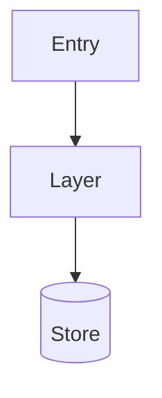

# Output Template — ARCHITECTURE_DOCUMENTATION.md

Copy this skeleton at the start of each audit run. Replace every
`<!-- ... -->` placeholder with content grounded in the actual codebase.
Delete any section that is genuinely not present in the repo (e.g. no
messaging system → delete section 8 entirely).

---

# Architecture, Security & Performance Audit

> <!-- One-line system description. What it does. Who uses it. -->

---

## 1. Executive Summary

<!-- What the system does, who uses it, core capabilities.
     3–5 sentences. No marketing language. -->

---

## 2. Repository Structure

| Path | Purpose |
|---|---|
| <!-- path --> | <!-- responsibility --> |

<!-- Flag stale, duplicated, or misplaced items with ⚠️ -->

---

## 3. Technology Stack

| Layer | Technology | Version |
|---|---|---|
| <!-- layer --> | <!-- technology --> | <!-- version or "Not pinned" --> |

---

## 4. Architecture Overview

<!-- Describe components, layers, and how they interact.
     Name the actual patterns in use (layered, CQRS, event-driven, etc.) -->

---

## 5. API Architecture

<!-- Endpoint inventory: route · method · auth · request/response shape.
     Use a table. Include error handling and versioning strategy. -->

| Method | Route | Auth | Description |
|---|---|---|---|
| <!-- GET/POST/... --> | <!-- /path --> | <!-- Bearer/None/... --> | <!-- what it does --> |

---

## 6. Database Architecture

<!-- Schemas, tables/collections, relationships, migrations, access patterns.
     Include an ER diagram if schema is verifiable. -->

---

## 7. Request Lifecycle

<!-- Trace ONE representative request end-to-end.
     Name actual classes and functions at each step. -->

1. **Entry**: <!-- how the request arrives -->
2. **Auth**: <!-- how it is authenticated/authorised -->
3. **Business logic**: <!-- which class/function handles it -->
4. **Data access**: <!-- which repository/query runs -->
5. **Response**: <!-- how the response is assembled and returned -->

---

## 8. Event / Messaging Architecture

<!-- Include ONLY if a messaging system is present (Kafka, RabbitMQ, SQS, etc.)
     Cover: queues, consumers, retry logic, DLQ handling.
     DELETE THIS SECTION if no messaging is found. -->

---

## 9. Security Review

<!-- Use the security-review-prompt.md fragment for formatting rules.
     Cover: secrets, TLS, auth, CVEs, input validation, PII, debug code. -->

---

## 10. Performance Assessment

<!-- For each finding:
     Severity · Evidence (file:line) · Impact · Recommendation -->

---

## 11. Scalability & Reliability

| Concern | Finding | Verdict |
|---|---|---|
| Statelessness | <!-- finding --> | <!-- ✅ ⚠️ ❌ --> |
| Single points of failure | <!-- finding --> | |
| Circuit breakers | <!-- finding --> | |
| Retry logic | <!-- finding --> | |
| Graceful degradation | <!-- finding --> | |

---

## 12. Observability

<!-- What is actually configured:
     - Structured logging (format, level control)
     - Distributed tracing (correlation IDs, trace headers)
     - Metrics (Prometheus, StatsD, etc.)
     - Alerting
     Call out gaps explicitly. -->

---

## 13. Technical Debt

| Priority | Item | Root Cause | Fix |
|---|---|---|---|
| P0 | <!-- item --> | <!-- root cause --> | <!-- fix --> |
| P1 | | | |
| P2 | | | |
| P3 | | | |

---

## 14. Diagrams

<!-- Use diagram-generation-prompt.md for rules and templates.
     Include: system context · high-level architecture · request sequence
     Include ER diagram only if schema is verified.
     Ask user about draw.io export before producing output. -->

---

*@simplymanas*
