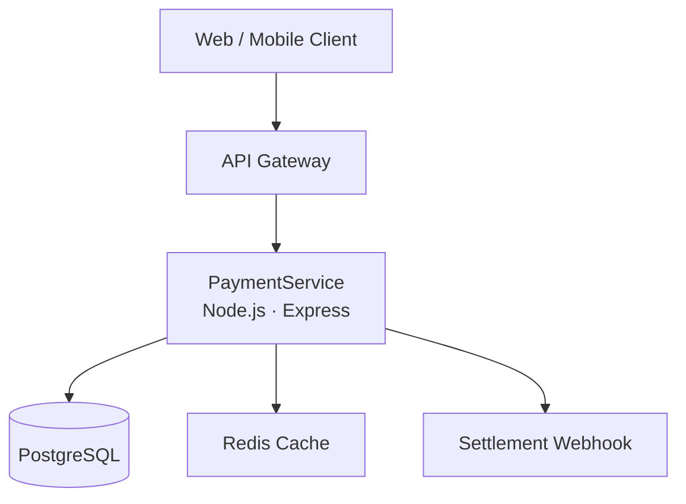

# Sample Output Structure — architecture-audit

This shows the expected shape and tone of `ARCHITECTURE_DOCUMENTATION.md`.
Content is illustrative — a real run populates every field from actual code.

---

# Architecture, Security & Performance Audit

## 1. Executive Summary

PaymentService is a Node.js REST API that processes card payments and
refunds for the checkout platform. It is consumed by the web storefront
and the mobile app. Core capabilities: charge, capture, refund, and
webhook relay to downstream settlement systems.

---

## 2. Repository Structure

| Path | Purpose |
|---|---|
| `src/` | Application source — controllers, services, repositories |
| `src/config/` | Environment-based config loading |
| `migrations/` | Knex SQL migrations |
| `test/` | Jest unit + integration tests |
| `Dockerfile` | Production image |
| `.github/workflows/` | CI: lint, test, deploy |
| `docs/` | ⚠️ Stale — last updated 14 months ago |

---

## 3. Technology Stack

| Layer | Technology | Version |
|---|---|---|
| Runtime | Node.js | 20.x |
| Framework | Express | 4.18.2 |
| ORM | Knex | 3.1.0 |
| Database | PostgreSQL | 15 |
| Cache | Redis | 7.2 |
| CI | GitHub Actions | — |

---

## 9. Security Review

### 9.1 JWT secret hardcoded in source — CRITICAL
**Evidence**: `src/config/auth.js:12` — `secret: 'supersecret123'`
**Impact**: Any attacker with source access can forge tokens for any user.
**Recommendation**: Load from `process.env.JWT_SECRET`; rotate immediately.

### 9.2 SQL injection risk in search endpoint — HIGH
**Evidence**: `src/controllers/product.js:44` — raw string interpolation into SQL query.
**Impact**: Authenticated users can read or delete arbitrary rows.
**Recommendation**: Use parameterised queries via Knex's `.where('col', value)`.

---

## 14. Diagrams

---

*@simplymanas*
