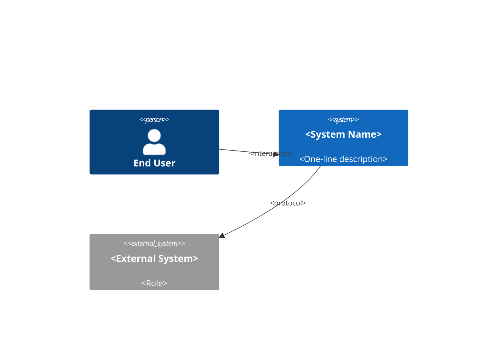
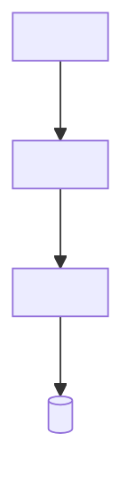
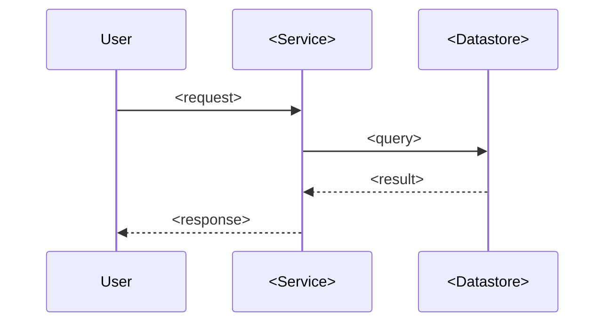
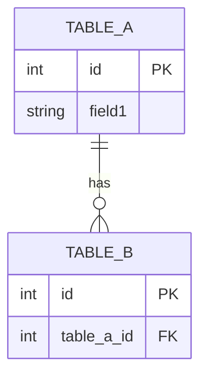

# Prompt Fragment — Diagram Generation

Use this prompt fragment when generating the Diagrams section of
`ARCHITECTURE_DOCUMENTATION.md`.

---

## Rules before drawing

- Only diagram components that were verified in the codebase.
- Do not draw databases, queues, or services that appear in docs but not in
  code or config.
- If a component's role is ambiguous, label it with a `?` suffix.

---

## Required diagrams and their Mermaid templates

### 1. System Context

### 2. High-Level Architecture

### 3. Request Sequence (auth or most complex flow)

### 4. ER Diagram (only if a DB schema is present)

---

## After drawing

Ask the user:
> "Would you like these diagrams exported as draw.io files as well, or is
> Mermaid sufficient?"

Wait for the answer before producing any draw.io output.
