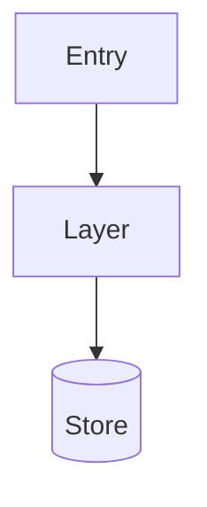

# Output Template — arch-audit.md

Copy this skeleton at the start of each first-principles audit run.
Replace every `<!-- ... -->` placeholder with content grounded in the
actual codebase. Do not start filling sections until exploration is complete.

---

# Architecture, Security & Performance Audit

> Day-one first-principles audit — <!-- system name -->

---

## 1. Executive Summary

<!-- What the system does, who uses it, core capabilities.
     Three sentences maximum. No marketing language. -->

---

## 2. Repository Structure

| Path | Purpose |
|---|---|
| <!-- path --> | <!-- responsibility — flag stale/duplicate items with ⚠️ --> |

---

## 3. Technology Stack

| Layer | Technology | Version |
|---|---|---|
| <!-- layer --> | <!-- technology --> | <!-- version — flag stale with ⚠️ --> |

---

## 4. Architecture Overview

<!-- How components interact. Which patterns are actually in use.
     Include a Mermaid flowchart of the real architecture. -->

---

## 5. Request Lifecycle

<!-- Trace one representative, high-stakes request end-to-end.
     Name actual classes and functions at every step. -->

1. **Entry**: <!-- -->
2. **Auth**: <!-- -->
3. **Business logic**: <!-- -->
4. **Data access**: <!-- -->
5. **Response**: <!-- -->

---

## 6. Security Review

<!-- For each finding — use finding-evidence-format.md for structure.
     Cover: secrets, TLS, auth, CVEs, input validation, PII, debug code. -->

---

## 7. Performance Assessment

<!-- For each finding: Severity · Evidence (file:line) · Impact · Fix -->

---

## 8. Scalability & Reliability

| Concern | Finding | Verdict |
|---|---|---|
| Statelessness | <!-- --> | <!-- ✅ ⚠️ ❌ --> |
| Single points of failure | <!-- --> | |
| Circuit breakers | <!-- --> | |
| Retry logic | <!-- --> | |
| Graceful degradation | <!-- --> | |

---

## 9. Observability

<!-- Logging · Tracing · Metrics · Alerting — what is actually configured.
     Call out gaps explicitly. -->

---

## 10. Technical Debt — Prioritised

| Priority | Item | Root Cause | Fix |
|---|---|---|---|
| P0 | <!-- --> | <!-- --> | <!-- --> |
| P1 | | | |
| P2 | | | |
| P3 | | | |

---

## 11. What Everyone Is Too Close To See

<!-- Use blind-spot-analysis-prompt.md.
     This is the most important section.
     3–5 items. No softening. Name the file. State the risk. -->

---

## 12. What I Would Kill

<!-- Numbered list. One sentence of justification per item.
     Name the specific file or class. Be direct. -->

1. **`<FileName>`** — <!-- one sentence justification -->

---

## 13. Diagrams

<!-- Mermaid only. Verified components only.
     System context · High-level architecture · Key request sequence
     ER or state diagram if DB/state machine is present. -->

---

## 14. The Contrarian 90-Day Bet

<!-- Use contrarian-bet-prompt.md for structure.
     The bet must be specific, time-bounded, and genuinely contrarian.
     Follow immediately with the steelman counter-argument. -->

> **Bet**: <!-- -->

**Rationale**: <!-- -->

**Strongest argument against this bet**: <!-- -->

---

*@simplymanas*
